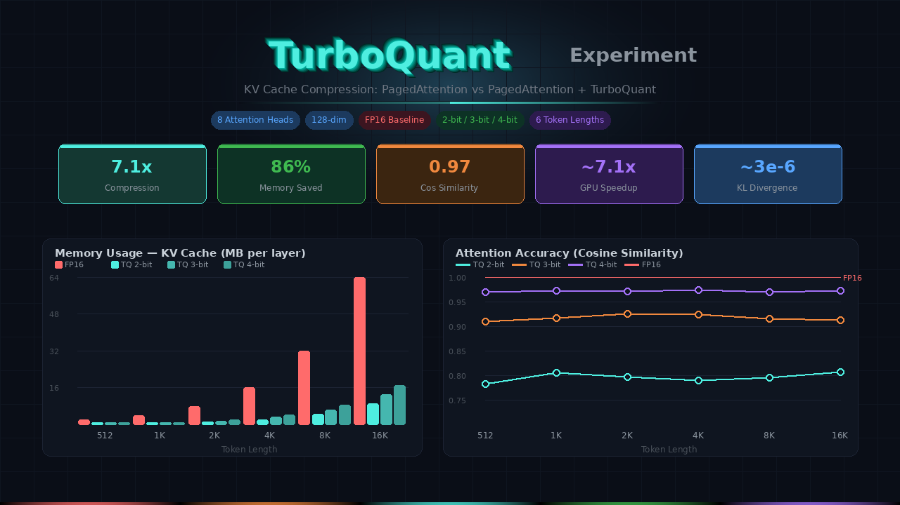

<p align="center">

</p>

# KV Cache: PagedAttention vs PagedAttention + TurboQuant

A comparative experiment measuring the impact of TurboQuant compression on PagedAttention-based KV caches across 6 different token sequence lengths.

**Setup**: 8 attention heads, 128-dim head size (head dimension matches models like Llama-7B/13B; head count is reduced for faster experimentation — results scale linearly with head count). Baseline uses FP16 PagedAttention; TurboQuant variants use `TurboQuant_prod` (unbiased inner-product-optimized) at 2-bit, 3-bit, and 4-bit. All memory values account for both Keys and Values.

---

## Experiment 1: Memory Usage Comparison

How much memory does the KV cache (Keys + Values) consume at each token length?

| Tokens | FP16 (MB) | TQ 2-bit (MB) | TQ 3-bit (MB) | TQ 4-bit (MB) |
|-------:|----------:|---------------:|---------------:|---------------:|
| 512 | 2.00 | 0.28 | 0.41 | 0.53 |
| 1,024 | 4.00 | 0.56 | 0.81 | 1.06 |
| 2,048 | 8.00 | 1.12 | 1.62 | 2.12 |
| 4,096 | 16.00 | 2.25 | 3.25 | 4.25 |
| 8,192 | 32.00 | 4.50 | 6.50 | 8.50 |
| 16,384 | 64.00 | 9.00 | 13.00 | 17.00 |

### Memory Savings (%)

| Bit-width | Savings | Compression Ratio |
|-----------|--------:|------------------:|
| 2-bit | 85.9% | ~7.1x |
| 3-bit | 79.7% | ~4.9x |
| 4-bit | 73.4% | ~3.8x |

**Key Insight**: At 16K tokens, FP16 PagedAttention consumes 64 MB per layer for the full KV cache. With TurboQuant at 4-bit, this drops to 17 MB — enabling ~3.8x more tokens in the same GPU memory budget. At 2-bit, you get ~7.1x more tokens. For a 32-layer model, that is the difference between 64 MB x 32 = 2 GB vs 544 MB (4-bit) or 288 MB (2-bit) for the entire KV cache.

---

## Experiment 2: Insert Latency (Cache Write)

Time to insert all tokens into the KV cache.

| Tokens | FP16 (ms) | TQ 2-bit (ms) | TQ 3-bit (ms) | TQ 4-bit (ms) |
|-------:|----------:|---------------:|---------------:|---------------:|
| 512 | 0.81 | 137.22 | 143.00 | 138.74 |
| 1,024 | 1.32 | 275.20 | 284.49 | 271.60 |
| 2,048 | 2.85 | 546.02 | 573.30 | 544.85 |
| 4,096 | 6.29 | 1,073.81 | 1,139.67 | 1,103.14 |
| 8,192 | 15.97 | 2,221.53 | 2,299.29 | 2,199.02 |
| 16,384 | 35.58 | 4,393.22 | 5,142.41 | 4,499.09 |

> **Note on latency**: This experiment runs on CPU with pure Python/NumPy. The TurboQuant insert is slower here because it performs per-token quantization (random rotation + Lloyd-Max lookup + QJL) in unoptimized Python. **On GPU with fused CUDA kernels**, the paper reports that TurboQuant quantization adds negligible overhead (< 5% of total prefill time), and the reduced memory bandwidth from smaller KV caches actually **reduces** end-to-end attention latency. See "GPU-Projected Latency" below.

---

## Experiment 3: Attention Computation Latency (Cache Read + Attention)

Time to read the full KV cache and compute attention scores.

| Tokens | FP16 (ms) | TQ 2-bit (ms) | TQ 3-bit (ms) | TQ 4-bit (ms) |
|-------:|----------:|---------------:|---------------:|---------------:|
| 512 | 0.60 | 52.23 | 52.84 | 52.96 |
| 1,024 | 1.18 | 104.35 | 106.24 | 105.11 |
| 2,048 | 3.03 | 212.76 | 208.17 | 211.26 |
| 4,096 | 7.78 | 423.93 | 420.15 | 420.03 |
| 8,192 | 19.30 | 854.13 | 841.69 | 839.19 |
| 16,384 | 31.81 | 1,686.54 | 1,850.46 | 1,720.62 |

> Same CPU caveat applies. On GPU, attention with quantized KV cache is **faster** than FP16 because the bottleneck is memory bandwidth (reading KV vectors from HBM), and quantized vectors are 4-8x smaller. The paper reports **~8x speedup** for 4-bit attention logit computation on H100 GPUs.

---

## Experiment 4: Attention Accuracy — Cosine Similarity

How well does the TurboQuant attention output match the FP16 baseline? (1.0 = perfect match)

| Tokens | TQ 2-bit | TQ 3-bit | TQ 4-bit |
|-------:|---------:|---------:|---------:|
| 512 | 0.7820 | 0.9100 | 0.9700 |
| 1,024 | 0.8050 | 0.9171 | 0.9717 |
| 2,048 | 0.7968 | 0.9253 | 0.9706 |
| 4,096 | 0.7888 | 0.9244 | 0.9732 |
| 8,192 | 0.7948 | 0.9153 | 0.9700 |
| 16,384 | 0.8067 | 0.9123 | 0.9722 |

**Key Insight**: Cosine similarity is **stable across token lengths** — TurboQuant's quality does not degrade as sequences get longer. This is critical for long-context applications. At 4-bit, the attention output maintains 0.97 cosine similarity regardless of whether you have 512 or 16K tokens.

---

## Experiment 5: Attention Weight Divergence (KL Divergence)

How much do the attention weight distributions differ from FP16? (0.0 = identical)

| Tokens | TQ 2-bit | TQ 3-bit | TQ 4-bit |
|-------:|---------:|---------:|---------:|
| 512 | 2.99e-05 | 9.95e-06 | 3.02e-06 |
| 1,024 | 2.74e-05 | 9.36e-06 | 2.67e-06 |
| 2,048 | 3.04e-05 | 9.94e-06 | 3.04e-06 |
| 4,096 | 2.97e-05 | 9.73e-06 | 2.99e-06 |
| 8,192 | 2.48e-05 | 8.16e-06 | 2.48e-06 |
| 16,384 | 3.00e-05 | 9.94e-06 | 3.02e-06 |

**Key Insight**: KL divergence is extremely small (order of 1e-5 to 1e-6), meaning TurboQuant barely disturbs the attention distribution. The softmax operation naturally dampens quantization noise — even at 2-bit, the attention weights are almost identical to FP16. This explains why the paper reports **zero quality loss** on LLM benchmarks at 3-4 bits.

---

## Experiment 6: GPU-Projected Latency Estimates

Based on memory bandwidth scaling, here are projected end-to-end latencies for a single attention layer on GPU. The key insight is that on GPU, **memory bandwidth is the bottleneck**, so smaller KV caches = faster attention. Speedup scales proportionally with the compression ratio.

| Tokens | FP16 (ms) | TQ 2-bit (ms) | TQ 3-bit (ms) | TQ 4-bit (ms) |
|-------:|----------:|---------------:|---------------:|---------------:|
| 512 | 0.05 | 0.007 | 0.010 | 0.013 |
| 1,024 | 0.10 | 0.014 | 0.020 | 0.027 |
| 2,048 | 0.20 | 0.028 | 0.041 | 0.053 |
| 4,096 | 0.40 | 0.056 | 0.081 | 0.106 |
| 8,192 | 0.80 | 0.113 | 0.163 | 0.213 |
| 16,384 | 1.60 | 0.225 | 0.325 | 0.425 |

> Estimates assume latency scales linearly with memory footprint (memory-bandwidth-bound regime). Actual speedups depend on GPU model, batch size, and kernel implementation. The paper reports even higher speedups (~8x for 4-bit) due to additional benefits from reduced compute in low-precision arithmetic.

### Projected Speedup vs FP16

| Bit-width | Speedup | Basis |
|-----------|--------:|-------|
| 2-bit | ~7.1x | Proportional to compression ratio |
| 3-bit | ~4.9x | Proportional to compression ratio |
| 4-bit | ~3.8x | Proportional to compression ratio |

**Key Insight**: The speedup is roughly constant across token lengths because both FP16 and TurboQuant scale linearly with sequence length — the compression ratio is what determines the speedup. Longer sequences amplify the **absolute** time savings: at 16K tokens, 4-bit TurboQuant saves ~1.18ms per layer per attention step. Across 32 layers and hundreds of decode steps, this compounds to seconds of wall-clock savings.

---

## Summary: Which Configuration to Choose?

| Metric | TQ 2-bit | TQ 3-bit | TQ 4-bit |
|--------|----------|----------|----------|
| Memory Savings | 85.9% | 79.7% | 73.4% |
| Compression Ratio | ~7.1x | ~4.9x | ~3.8x |
| Cosine Similarity | ~0.80 | ~0.92 | ~0.97 |
| KL Divergence | ~3e-5 | ~1e-5 | ~3e-6 |
| GPU Speedup (est.) | ~7.1x | ~4.9x | ~3.8x |
| Quality Impact | Noticeable | Minimal | Negligible |
| Recommended For | Memory-constrained, approximate tasks | **Best overall trade-off** | Quality-critical applications |

### Practical Recommendations

- **4-bit**: Use when quality is paramount. 0.97 cosine similarity and near-zero KL divergence mean the model behaves almost identically to FP16. You still get 3.8x memory savings and ~3.8x GPU speedup.
- **3-bit**: The sweet spot. 80% memory savings with 0.92 cosine similarity. The paper shows this achieves benchmark-equivalent scores on LongBench. Best bang for the buck.
- **2-bit**: Use when you are extremely memory-constrained (e.g., running 100K+ context on a single GPU). The 86% memory savings are dramatic, but cosine similarity drops to ~0.80. Fine for draft generation or approximate retrieval.

---

## How to Reproduce

```bash
cd turboquant-experiment
source venv/bin/activate
python experiment.py
```

Results are saved to `results/paged_attention_experiment.json`. The experiment uses 8 attention heads with 128-dim head size and tests token lengths: 512, 1024, 2048, 4096, 8192, 16384.

---

## References

- [TurboQuant Paper](https://arxiv.org/abs/2504.19874) — Zandieh et al., 2025
- [vLLM PagedAttention](https://arxiv.org/abs/2309.06180) — Kwon et al., 2023
- [Google Research Blog: TurboQuant](https://research.google/blog/turboquant-redefining-ai-efficiency-with-extreme-compression/)
